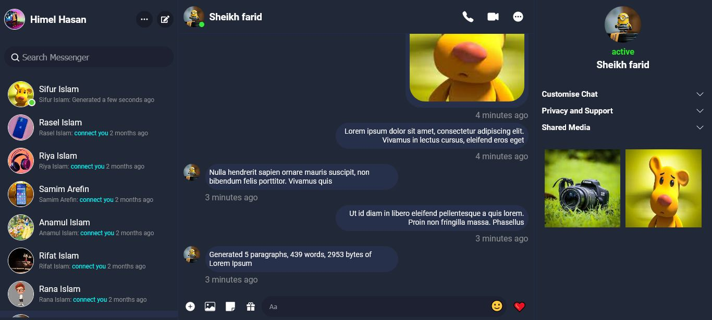

# Real time chat application like facebook messenger

# Application feature

  - Real time Text Messaging
  - Real time image Messaging
  - Real time emoji Messaging
  - Real time message seen, unseen system
  - Real time message received and sending sound
  - Real time received message notification system
  - User search system
  - User login and register system
  - Application dark and light mode system
  
  
  
# Following tools are used to develop the application
    
  ## Frontend Tools
    
  - React Js
  - Redux
  - socket.io-client
  - Sass
    
  ## Backend Tools
    
  - Programming languages : JavaScript
  - Node Js
  - Frameworks : Express Js
  - Databases : MongoDB
  - Socket.io
   
### How to make this application  [visit](https://www.youtube.com/playlist?list=PLTyDDs5BP9JTf_f6zCjSS96CUA9vxXfIY)
